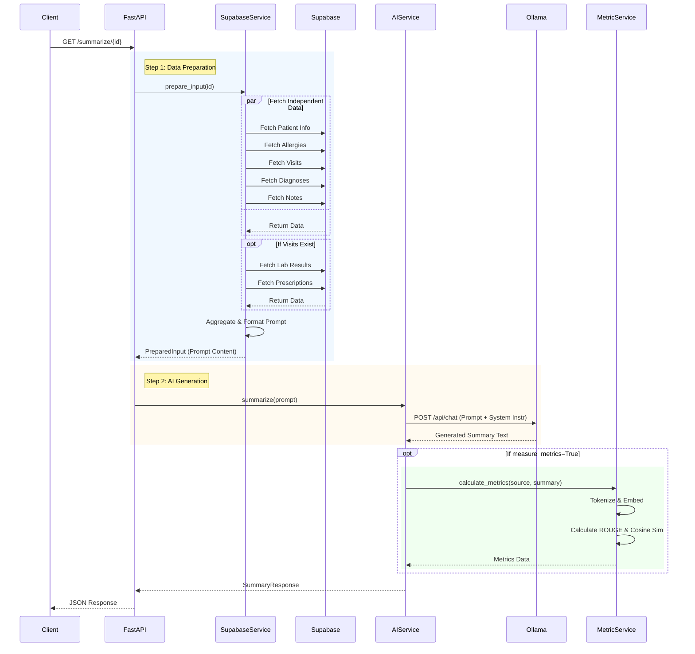
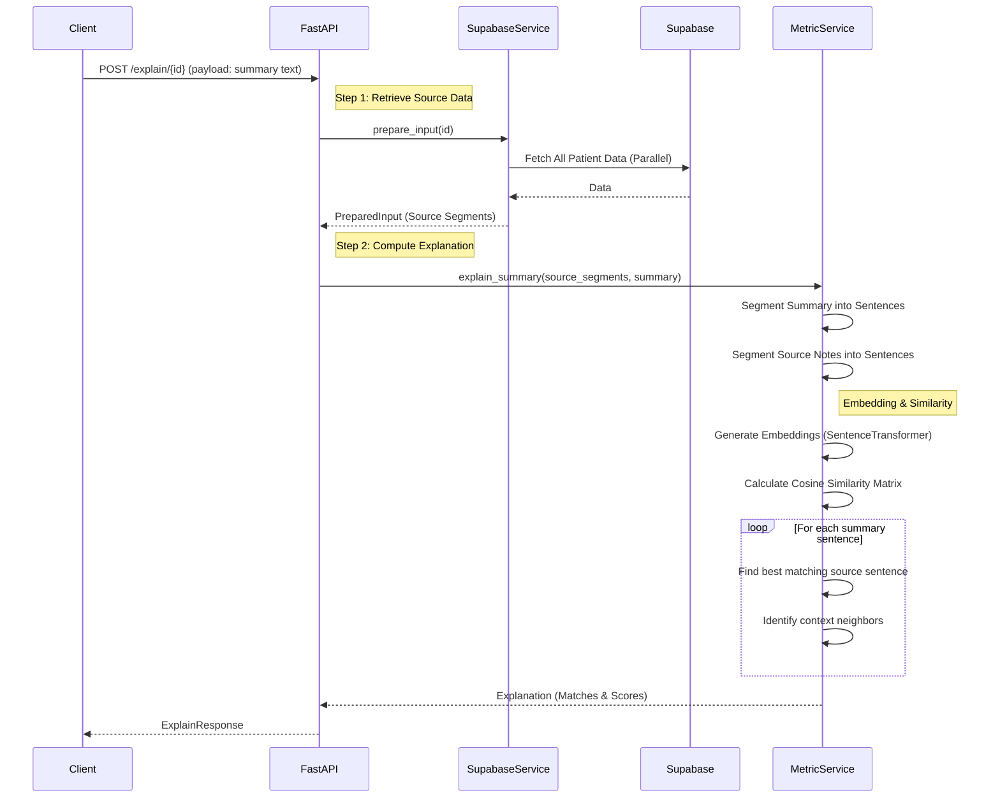

# CMEC AI Backend System Design

This document outlines the system architecture and data flow for the CMEC AI Backend.

## 1. System Architecture

The following flowchart illustrates the high-level architecture and component interactions.

```mermaid
graph TD
    Client[Client Application]

    subgraph "FastAPI Backend"
        API[API Endpoints]
        subgraph "Services"
            SupaSvc[Supabase Service]
            AISvc[AI Service]
            MetSvc[Metric Service]
        end
    end

    subgraph "External Systems"
        Supabase[(Supabase Database)]
        Ollama[Ollama AI Model]
    end

    %% Client Interactions
    Client -->|HTTP Requests| API

    %% API to Services
    API -->|Get Data| SupaSvc
    API -->|Generate Summary| AISvc
    API -->|Explain/Evaluate| MetSvc

    %% Service Interactions
    SupaSvc <-->|Query/Fetch| Supabase
    AISvc <-->|Chat Completion| Ollama
    AISvc -.->|Calculate Metrics (Optional)| MetSvc

    %% Service Details
    SupaSvc -- Aggregates Patient Data --> API
    MetSvc -- Embeddings & ROUGE --> API
```

### Components Description

*   **Client Application**: The frontend or external system initiating requests.
*   **API Endpoints (`app/api/endpoints.py`)**: The entry point for HTTP requests. Handles routing and response formatting.
*   **Supabase Service (`app/services/supabase_service.py`)**: Responsible for fetching and aggregating patient data from Supabase. It performs parallel queries to fetch patient info, allergies, visits, diagnoses, notes, lab results, and prescriptions, combining them into a structured prompt.
*   **AI Service (`app/services/ai_service.py`)**: Interacts with the Ollama API to generate medical summaries. It constructs the prompt using the aggregated data and system instructions.
*   **Metric Service (`app/services/metric_service.py`)**: Handles the "Explainability" and evaluation metrics. It uses local models (SentenceTransformer, ROUGE) to calculate similarity scores and map summary sentences back to source data.
*   **Supabase**: The external Postgres database hosting medical records.
*   **Ollama**: The external AI inference engine running the LLM.

---

## 2. Data Flow: Summarization

This sequence diagram details the process of generating a medical summary (`/api/summarize/{id}`).



---

## 3. Data Flow: Explanation

This sequence diagram details the process of explaining a summary (`/api/explain/{id}`).


